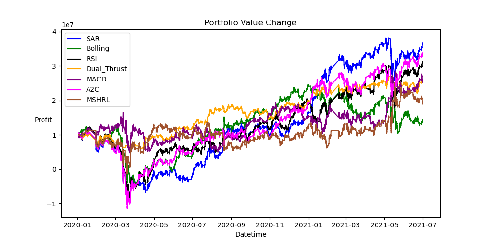
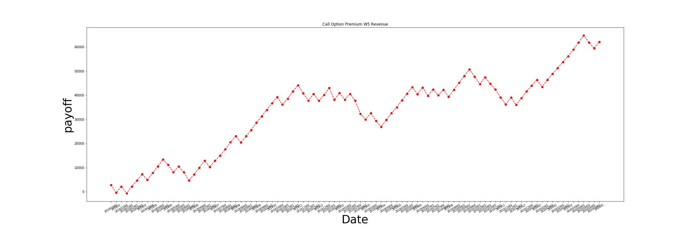

# Python_Code

### Raw_Tech_Back_Test
This project is for the RL model I'm supporting called **MSHRL**  
We need to compare different model to prove our model is overwhelmed others  
The backtest of some raw models which include MACD, RSI, SAR, Bolling, Dual_Trust  
For others(FinRL), are the data create by RL Model (I'm not showing this code, you can search it online)  

> If you are new here, you can just run main(), I've set all the data be ready.
#### First Craete Raw Data

```
python Processing_Raw_Data.py
```
**Beacause of data is too big to upload, I've uploaed the processed data**

#### Run Each Code to Generate Signals

```
python Bolling.py Dual_Trust.py MACD.py Parabolic SAR.py RSI.py
```
**You can use the concat_dataframe function to have all performance**

#### To Generate All Performance

```
python main()
```




---
### Stock
This project is to crawl the TWSE data to analyse

#### Crawler_Close.py
This code is to crawl the daily quotes, I will save it as csv to create db later

```
python Crawler_Close.py
```

#### Crawler_Individual.py
This code will create db for searching, I use "2330" and "2303" as example

```
python Crawler_Close.py
```

#### Stock_Risk_MLE.py and MACD&RSI_Draw.py
This code is using the db to collect data to generate diagram  
You must crawl enough data to run the code(default is 5 days in Crawler_Close.py)

```
python Stock_Risk_MLE.py MACD&RSI_Draw.py
```
---
### Graduate Project
This project is for my undergraduate project, which is try to have the odds before the games. Our Best Residual is 0.144639. We thought that We can Handel Each Points with 0.5 different from Pinnacle.  

#### Create_DF.py
Use our analysis to calcualte the scores of each team

#### Generate_Table.py
Use Traing Data to Generate the Interval Table for Test

#### Linear_Model.py
For Better Performance, We let our data go through Linear Model.  
OH: Ternary Linear Regression.  
OD: Bivariate Linear Regression.  

#### main.py
Could Directly Run main.py

```
python main()
```

---
### Option_Strategy
This code is for my intern in trading organization. I only show some of the development with one data because I'm not intend to let the viewers to run this code.  
In this code, I use statistic ways to find out some pattern for options strategy. Including Time, Strike Price and Premium.  
There are some key point.
1. I exclude weeks that don't have full trading days which is not 5 days.
2. I use convolutional way to let my strategy more robust.
3. I'm not using the AI / ML / DL model, only use statistic
4. I use heatmap to demonstate result.

#### Result - Heatmap


#### Rsult - Payoff



